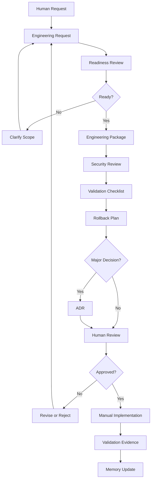
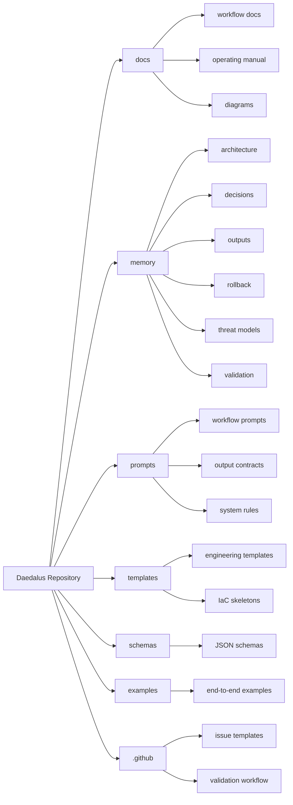

# Daedalus Diagrams

## Purpose

This directory contains Mermaid diagrams that explain the Daedalus platform, repository structure, workflow model, human approval gates, and relationship to the Zero Trust lab.

These diagrams are intended to render directly in GitHub Markdown.

## Diagrams

| Diagram | Purpose |
|---|---|
| `daedalus-workflow.mmd` | Shows the end-to-end Daedalus engineering workflow |
| `repository-architecture.mmd` | Shows how the repository is organized |
| `human-in-the-loop-model.mmd` | Shows where human approval is required |
| `zero-trust-lab-relationship.mmd` | Shows the relationship between the lab and Daedalus |

## How to View

GitHub can render Mermaid diagrams inside Markdown files and Mermaid code blocks.

You can also copy the contents of a `.mmd` file into the Mermaid Live Editor or a local Markdown preview tool that supports Mermaid.

## Design Notes

Daedalus diagrams should emphasize:

- Proposed work versus approved work
- Human approval gates
- Security review
- Validation and rollback
- Project memory
- Architecture decision tracking
- The lab as the environment
- Daedalus as the engineering copilot

## Diagram Index

### End-to-End Workflow

### Repository Architecture

